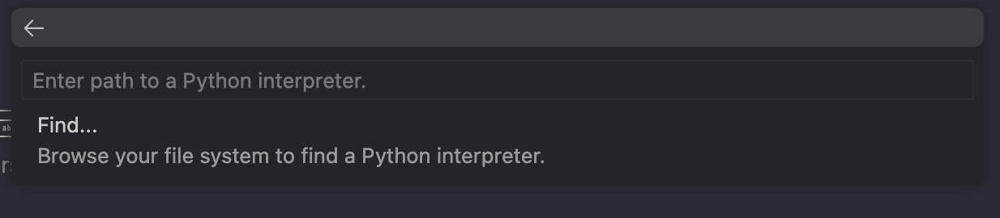

# Qronos REST API

This directory contains the REST API for the Qronos service. It is built using FastAPI and SQLAlchemy running on SQLLite.

The REST API is responsible for managing the state of the Qronos service, including:

- the creation, execution, monitoring, and response of jobs to the UI
- powering the UI with data from the database (e.g. job history, job status, user management, etc.)

To run the API Server, run:

```bash
bazel run //backend/python:main
```

This will start the server on [http://localhost:8080](http://localhost:8080). A SQLite database will automatically be created in `backend/python` called `database.db`.

For the swagger docs, visit [http://localhost:8080/docs](http://localhost:8080/docs).

## Local Dev

To setup local development environment, run:

```bash
bazel run //backend/python:venv
```

This will generate `.venv` in the root of the python directory with the full bazel provided python toolchain and dependencies.

### MacOS & VSCode Users

_Do not_ use Finder to specify the interpreter path. If you look carefully there is a blank above "Find" for pasting the relative path to the generated `.venv` directory.



Or if you are using our checked in `settings.json`, just select the default interpreter.

### Live Reload

If you are developing and want live reload, install `ibazel` and run the following command:

```bash
ibazel run //backend/python:main
```

## Adding deps

To add dependencies, add them to the `requirements.in` file and run:

```bash
bazel run //backend/python:generate_requirements_lock
```

Which will generate a new `requirements.txt` lock file.

If you're using gazelle, you should also run:

```bash
bazel run //backend/python:gazelle_python_manifest.update
```
